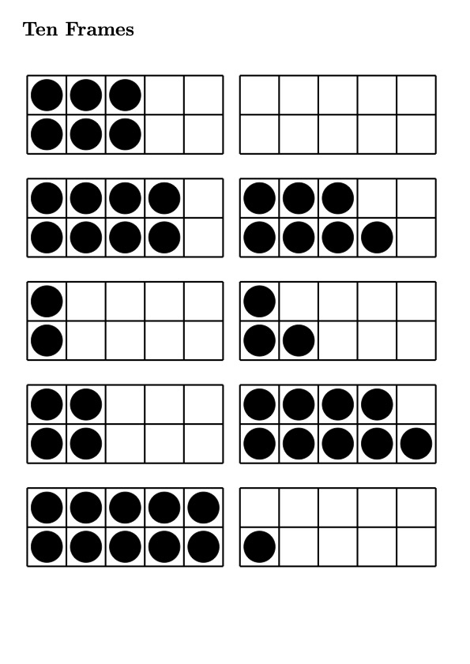

## Ten Frames generator

### Install requirements

    brew install basictex

    python3 -m venv venv
    source venv/bin/activate
    pip install -r requirements.txt

### Generate a random PDF

    ./tenframes.py

